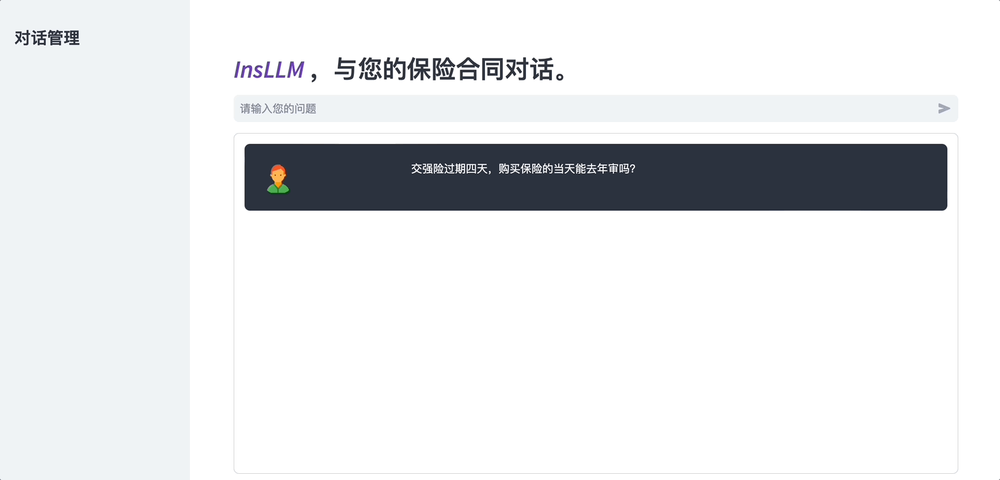
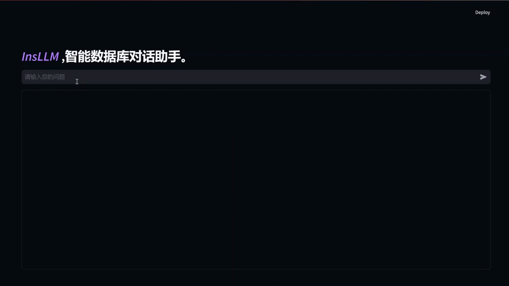
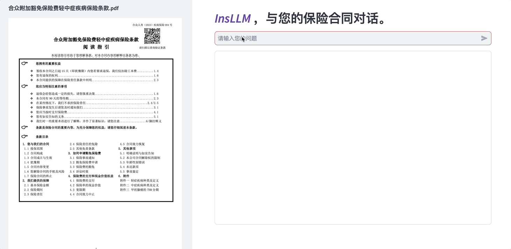

[中文](https://github.com/HaileyFamo/InsQABench/tree/main) | EN

<h1>InsQABench</h1>
  

Paper | 🤗[Huggingface](https://huggingface.co/datasets/FrankRin/Insur-QA)

InsQABench 由华中科技大学 VLR Lab（视觉与深度学习研究组）开发并开源的中文保险数据集。包含中文的**保险常识问答**、**保险数据库问答**、**保险合同问答**三个任务，专为普通用户群体和应用场景设计。我们针对保险领域复杂的专业术语和文档格式进行了信息提取，并基于公开的保险数据和真实世界的保险文档构建了数据集。我们还对流行的开源大模型在我们的数据集上进行了测试。

我们将在本项目中开源如下资源：
* [InsQABench 数据集](https://huggingface.co/datasets/FrankRin/Insur-QA)
* [中文保险条款数据集](#insur-qa-数据集)

## 新闻

**[2024/10/07]** InsQABench v1.0 已正式发布，开源 [InsQABench 数据集](https://huggingface.co/datasets/FrankRin/Insur-QA) 和[中文保险条款数据集](#insur-qa-数据集)。

## 目录
- [任务描述](#任务描述)
  - [保险常识问答](#保险常识问答)
  - [保险数据库问答](#保险数据库问答)
  - [保险合同问答](#保险合同问答)
- [Demo](#demo)
- [InsQABench](#insqabench)
  - [数据集构建](#数据集构建)
  - [数据集组成](#数据集组成)
- [模型评测](#模型评测)
  - [保险常识问答](#保险常识问答)
  - [保险数据库问答](#保险数据库问答)
  - [保险合同问答](#保险合同问答)
- [协议](#协议)

## 任务描述
- 保险常识问答：  
  该任务聚焦于基础的保险常识问答，主要涵盖保险领域的基本概念和术语。通过引入监督微调（SFT）技术，我们旨在提升模型对保险相关问题的理解能力和回答精准性。本任务的目标是评估模型在掌握基本保险知识方面的表现。

- 保险数据库问答：  
  本任务专注于从结构化保险数据库中检索信息。我们提出了 SQL-ReAct 方法，使模型能够生成准确的 SQL 查询，与数据库交互，并对查询结果进行迭代优化，从而生成精确的答案。本任务评估了模型在保险数据库操作与复杂信息检索中的性能。

- 保险合同问答：  
  该任务处理复杂的保险合同，通过引入 RAG-ReAct 方法，模型可以从非结构化数据中检索、解释和提取关键信息。本任务旨在测试模型在理解和分析复杂保险合同文档时的能力。

## Demo
以下展示了模型在 InsQABench 不同任务数据集上微调后的问答的结果：
<!-- Demo GIF -->
### 保险常识问答

### 保险数据库问答

### 保险合同问答

## InsQABench
### 数据集构建
- 保险常识问答部分，我们收集了互联网上的问题，并使用GPT3.5生成回答作为训练集。我们使用了 InsuranceQA_zh 数据集作为测试集。

- 保险合同问答部分，我们在互联网上下载了多家保险公司 PDF 格式的保险条款（见[中文保险条款数据集](#中文保险条款数据集)），并使用 Adobe PDF Extract API 解析。基于对解析结果进行段落文本重组后的数据使用 Gemini 1.5 Pro 生成 Question-Answer (QA) 对，结合原文中段落作为证据 (Evidence) 组成 <Q,A,E> 三元组。我们划分了最终生成的数据集得到训练集和测试集。

### 数据集组成

<table border="1">
  <tr>
    <th>任务</th>
    <th>数据集</th>
    <th>来源</th>
    <th>规模</th>
  </tr>
  <tr>
    <td rowspan="2">基本保险知识问答</td>
    <td>训练集</td>
    <td>BX_GPT3.5</td>
    <td>10k</td>
  </tr>
  <tr>
    <td>测试集</td>
    <td>Insurance_QA_zh</td>
    <td>3k</td>
  </tr>
  <tr>
    <td rowspan="2">保险合同问答</td>
    <td>训练集</td>
    <td>保险合同</td>
    <td>40k</td>
  </tr>
  <tr>
    <td>测试集</td>
    <td>保险合同</td>
    <td>100</td>
  </tr>
  <tr>
    <td rowspan="2">保险数据库问答</td>
    <td>训练集</td>
    <td>保险合同</td>
    <td>44k</td>
  </tr>
  <tr>
    <td>测试集</td>
    <td>保险合同</td>
    <td>546</td>
  </tr>
</table>

## 模型评测

我们构建了一个评估体系，从客观和主观两个维度对保险领域的大语言模型进行性能评估，以衡量模型在处理中文保险数据时的有效性。客观评估主要依赖于自动化的度量标准，如 BLEU-4、 ROUGE-l 分数，而主观评估则通过模拟真实用户查询的场景，由裁判模型对模型生成的答案进行打分。具体的评测代码及数据集见[模型评估](./eval/)。

<!-- 论文里的 Benchmark 图表 -->
### 保险常识问答
  我们使用了全部测试集进行了客观评测，并从中随机挑选了100条数据进行进一步的主观评测。
#### 客观评测
  <table border="1">
  <tr>
    <th>Model</th>
    <th>Prec.</th>
    <th>F1</th>
    <th>ROUGE-L</th>
  </tr>
  <tr>
    <td>Baichuan2</td>
    <td>38.15</td>
    <td>36.27</td>
    <td>7.37</td>
  </tr>
  <tr>
    <td>Baichuan2 (Fine-tuned)</td>
    <td>46.35</td>
    <td>44.42</td>
    <td>8.58</td>
  </tr>
  <tr>
    <td>GLM4</td>
    <td>30.57</td>
    <td>33.88</td>
    <td>8.77</td>
  </tr>
  <tr>
    <td>GLM4 (Fine-tuned)</td>
    <td>47.99</td>
    <td>45.60</td>
    <td>9.24</td>
  </tr>
  <tr>
    <td>Qwen1.5</td>
    <td>32.48</td>
    <td>34.94</td>
    <td>8.09</td>
  </tr>
  <tr>
    <td>Qwen1.5 (Fine-tuned)</td>
    <td>47.85</td>
    <td>45.19</td>
    <td>8.43</td>
  </tr>
</table>

#### 主观评测
<table border="1">
  <tr>
    <th>Model</th>
    <th>ACC</th>
    <th>PRO</th>
    <th>SIM</th>
    <th>AVG</th>
  </tr>
  <tr>
    <td>Baichuan2</td>
    <td>64.86</td>
    <td>64.82</td>
    <td>67.46</td>
    <td>65.71</td>
  </tr>
  <tr>
    <td>Baichuan2 (Fine-tuned)</td>
    <td>65.62</td>
    <td>65.79</td>
    <td>68.04</td>
    <td>66.48</td>
  </tr>
  <tr>
    <td>GLM4</td>
    <td>64.40</td>
    <td>66.50</td>
    <td>68.79</td>
    <td>67.23</td>
  </tr>
  <tr>
    <td>GLM4 (Fine-tuned)</td>
    <td>70.26</td>
    <td>70.41</td>
    <td>72.57</td>
    <td>71.08</td>
  </tr>
  <tr>
    <td>Qwen1.5</td>
    <td>64.12</td>
    <td>64.26</td>
    <td>66.42</td>
    <td>64.93</td>
  </tr>
  <tr>
    <td>Qwen1.5 (Fine-tuned)</td>
    <td>65.90</td>
    <td>65.80</td>
    <td>68.19</td>
    <td>66.63</td>
  </tr>
</table>

### 保险数据库问答
<table border="1">
  <tr>
    <th>Model</th>
    <th>ACC</th>
    <th>ROUGE-1</th>
    <th>ROUGE-L</th>
  </tr>
  <tr>
    <td>Wenxin (Two rounds)</td>
    <td>24.35</td>
    <td>28.49</td>
    <td>21.08</td>
  </tr>
  <tr>
    <td>Wenxin + SQL-ReAct (w/o fine-tuning)</td>
    <td>23.88</td>
    <td>34.35</td>
    <td>24.69</td>
  </tr>
  <tr>
    <td>GPT-3.5 (Two rounds)</td>
    <td>33.15</td>
    <td>32.71</td>
    <td>25.37</td>
  </tr>
  <tr>
    <td>GPT-3.5 + SQL-ReAct (w/o fine-tuning)</td>
    <td>50.73</td>
    <td>43.94</td>
    <td>34.35</td>
  </tr>
  <tr>
    <td>Baichuan2 (Two rounds)</td>
    <td>4.89</td>
    <td>19.63</td>
    <td>15.13</td>
  </tr>
  <tr>
    <td>Baichuan2 + SQL-ReAct (w/o fine-tuning)</td>
    <td>12.92</td>
    <td>30.91</td>
    <td>23.72</td>
  </tr>
  <tr>
    <td>Baichuan2 + SQL-ReAct (Fine-tuned)</td>
    <td>52.50</td>
    <td>26.52</td>
    <td>18.79</td>
  </tr>
  <tr>
    <td>Qwen1.5 (Two rounds)</td>
    <td>35.27</td>
    <td>37.06</td>
    <td>29.03</td>
  </tr>
  <tr>
    <td>Qwen1.5 + SQL-ReAct (w/o fine-tuning)</td>
    <td>43.23</td>
    <td>39.21</td>
    <td>30.21</td>
  </tr>
  <tr>
    <td>Qwen1.5 + SQL-ReAct (Fine-tuned)</td>
    <td>57.41</td>
    <td>49.85</td>
    <td>39.09</td>
  </tr>
</table>
  
### 保险合同问答
  我们使用了全部测试集进行了客观评测，并人工筛选了20篇来自不同公司的保险PDF合同。每份合同中，我们人工选择了5个问题，涵盖不同的问题类型和话题分布。我们使用人工选择的100个问题进行进一步的主观评测。
#### 客观评测
  <table border="1">
  <tr>
    <th>Model</th>
    <th>Prec.</th>
    <th>F1</th>
    <th>ROUGE-L</th>
  </tr>
  <tr>
    <td>Baichuan2</td>
    <td>44.30</td>
    <td>44.06</td>
    <td>26.98</td>
  </tr>
  <tr>
    <td>Baichuan2 (Fine-tuned)</td>
    <td>59.75</td>
    <td>46.54</td>
    <td>44.09</td>
  </tr>
  <tr>
    <td>GLM4</td>
    <td>62.01</td>
    <td>56.42</td>
    <td>54.34</td>
  </tr>
  <tr>
    <td>GLM4 (Fine-tuned)</td>
    <td>76.40</td>
    <td>69.10</td>
    <td>63.46</td>
  </tr>
  <tr>
    <td>Qwen1.5</td>
    <td>58.08</td>
    <td>45.17</td>
    <td>31.95</td>
  </tr>
  <tr>
    <td>Qwen1.5 (Fine-tuned)</td>
    <td>73.28</td>
    <td>72.66</td>
    <td>87.20</td>
  </tr>
</table>

#### 主观评测
  <table border="1">
  <tr>
    <th>Model</th>
    <th>ACC</th>
    <th>CPL</th>
    <th>CLR</th>
    <th>AVG</th>
  </tr>
  <tr>
    <td>GPT-4</td>
    <td>75.41</td>
    <td>75.77</td>
    <td>77.51</td>
    <td>76.23</td>
  </tr>
  <tr>
    <td>Kimi</td>
    <td>78.63</td>
    <td>79.48</td>
    <td>79.76</td>
    <td>79.29</td>
  </tr>
  <tr>
    <td>ChatPDF</td>
    <td>67.29</td>
    <td>68.46</td>
    <td>71.06</td>
    <td>69.60</td>
  </tr>
  <tr>
    <td>Wenxin</td>
    <td>77.79</td>
    <td>78.64</td>
    <td>78.80</td>
    <td>78.41</td>
  </tr>
  <tr>
    <td>GLM4 (Fine-tuned) + RAG</td>
    <td>74.10</td>
    <td>72.82</td>
    <td>74.00</td>
    <td>73.64</td>
  </tr>
  <tr>
    <td>GLM4 (Fine-tuned) + RAG-ReAct</td>
    <td>83.74</td>
    <td>83.27</td>
    <td>83.87</td>
    <td>83.63</td>
  </tr>
  <tr>
    <td>Qwen1.5 (Fine-tuned) + RAG</td>
    <td>72.62</td>
    <td>72.63</td>
    <td>73.24</td>
    <td>72.83</td>
  </tr>
  <tr>
    <td>Qwen1.5 (Fine-tuned) + RAG-ReAct</td>
    <td>73.64</td>
    <td>71.73</td>
    <td>73.81</td>
    <td>73.06</td>
  </tr>
</table>

  

## 协议

InsQABench 可在 Apache 许可证下使用。请查看 [LICENSE](./LICENSE) 文件获取更多信息。

## Star History

<picture>
    <source media="(prefers-color-scheme: dark)" srcset="https://api.star-history.com/svg?repos=HaileyFamo/InsQABench&type=Date&theme=dark" />
    <source media="(prefers-color-scheme: light)" srcset="https://api.star-history.com/svg?repos=HaileyFamo/InsQABench&type=Date" />
    
</picture>
